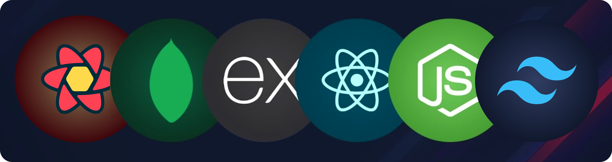

<h1 align="center">ZippyX</h1>

	Your Payments Made Lightning Fast

  

 &nbsp;  &nbsp;  &nbsp; &nbsp; 

<h2 align="center">

 &nbsp;[See it in Action]() &nbsp;»

</h2>

<h3 align="center">

[🗂️&nbsp; Frontend](./client/README.md)&nbsp;&nbsp;&nbsp;|&nbsp;&nbsp;&nbsp;[Backend &nbsp;📂](./server/README.md)

</h3>

 

  <a href="#introduction"><strong>Introduction</strong></a> 
	·&nbsp;<a href="#features"><strong>Features</strong></a> 
	·&nbsp;<a href="#tech-stack"><strong>Tech Stack</strong></a>
	·&nbsp;<a href="#local-development"><strong>Development Setup</strong></a> 
	·&nbsp;<a href="#local-development"><strong>Contributing</strong></a> 

 

## <a name="introduction">❄️&nbsp; Introduction</a>

Discover the essence of productivity with Simply Todo, an elegant task organization application. Delve into the codebase to explore more.

 

## <a name="features">🔋&nbsp; Features</a>

- Organized File and Folder Structure

- Fully Responsive Design

 

## <a name="tech-stack">⚙️&nbsp; Tech Stack</a>

- [MongoDB](https://www.mongodb.com/) – database

- [Express](https://expressjs.com/) – framework

- [React](https://react.dev/) – frontend

- [Node.js](https://nodejs.org/) – JavaScript runtime

- [Tailwind CSS](https://tailwindcss.com/) – CSS

- [Recoil](https://recoiljs.org/) – state management

- [Tanstack Query](https://tanstack.com/query/latest) – asynchronous state management

- [Mongoose](https://mongoosejs.com/) – ODM

- [Git](https://git-scm.com/) – versioning

- [Vite](https://vitejs.dev/) – building

- [Vercel](https://vercel.com/) – client-side deployments

- [Render](https://render.com/) – server-side deployments

 

## <a name="local-development"> 🖥️&nbsp;&nbsp; Local Development</a>

0.  **Prerequisites**  
    Make sure you have the following installed on your machine:

    - [Git](https://git-scm.com/)
    - [Node.js](https://nodejs.org/en)
    - [npm](https://www.npmjs.com/) (Node Package Manager)

 

## 🤝&nbsp;&nbsp;Contributing

Contributions are always welcome!

See [CONTRIBUTING.md](./CONTRIBUTING.md) for ways to get started.
  

## 🪪&nbsp;&nbsp; License

ZippyX is open-source under the [MIT License](./LICENSE).
Feel free to learn, add upon, and share!
